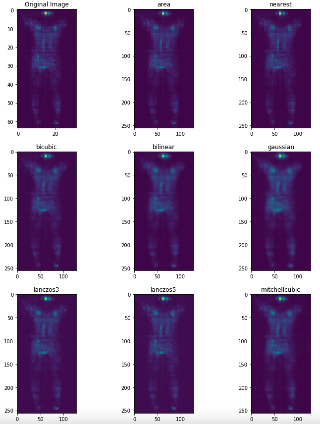
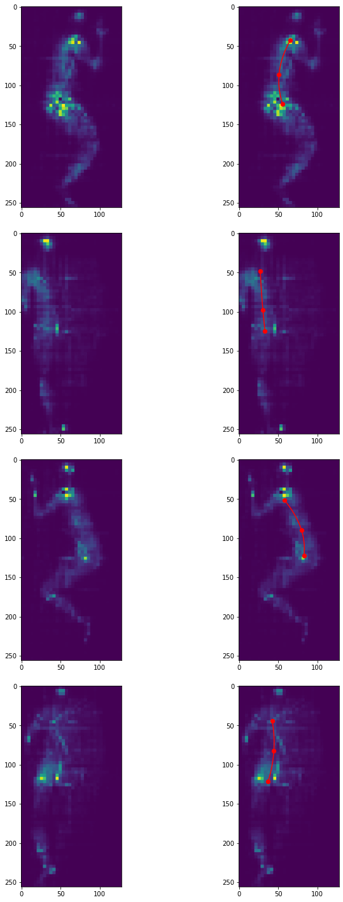

# Sleep Posture Monitoring

Image classification and Keypoint Detection types of problems on the pressure map dataset.

## Description

This project report deals with two types of Computer Vision problems namely Pose Classification and Keypoint detection on the publicly available pressure map dataset. Convolutional Neural Networks have been used to solve these problems. The dataset has been extracted from the text files and saved as images to form a suitable type of dataset for CNN models. Apart from CNNs, K-means machine learning algorithm was used to identify the clusters formed in both raw dataset and encodings extracted from the model. The encodings and the raw dataset have been reduced to two-dimensional space by the help of PCA and t-SNE reduction algorithms. The goal of the project is to classify the sleeping postures and assess a health metric. Please see the report for detailed information.

## Data
### Data Visualization

You can see every sleeping posture performed by a subject extracted from raw text files. Originally, there are 17 sleeping postures. However, they have been grouped together into 3 categories namely left, right, and supine:

### Resizing data

Images have been resized from 64x32 to 256x128. Here is a visualization of data resizing methods available in tf.image API: 

## Keypoint Detection

I have taken the subset of the image classification dataset for keypoint detection. I had around 350 data samples for this task. I labelled all the images using the the software called ”LabelMe”. An example from the keypoint detection dataset is shown in Fig. 4. In total, there are three keypoints: shoulder, mid-body, hip. Then, I implemented a function to detect the degree of a triangle formed by these three keypoints which is meant to asses some sort of metric for healthy sleeping posture. More the angle is close to the straight, better the sleeping posture is. The curved lines between the keypoints were drawn by using the Krogh’s interpolation from the Scipy library. Here are the predictions from the keypoint detection model: 

## Authors

Contributors names and contact info:

[@Orkhan Bayramli](https://www.linkedin.com/in/meorkhanbayramli/)  